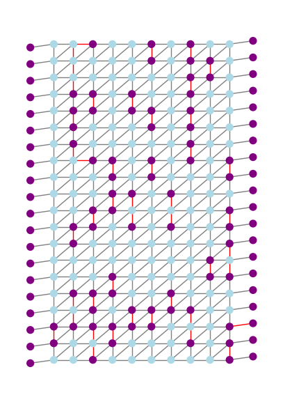
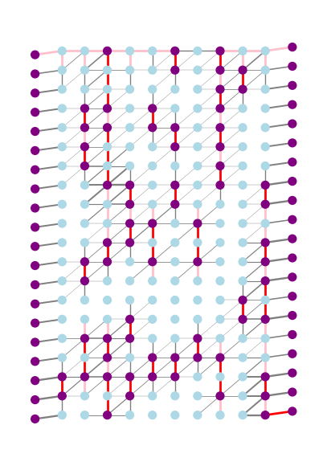
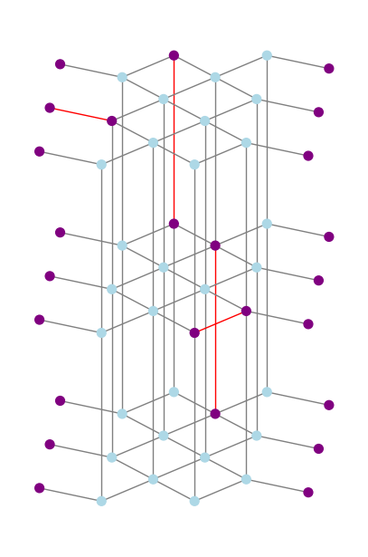
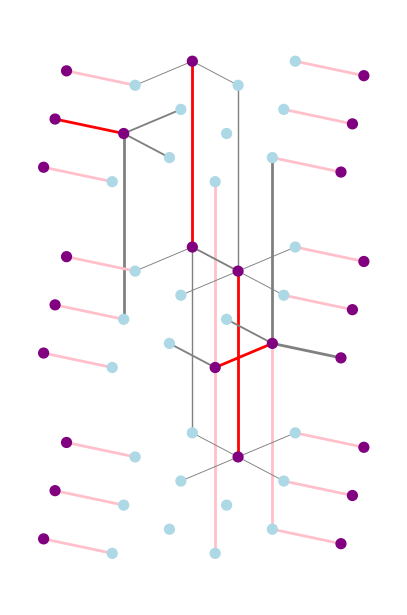
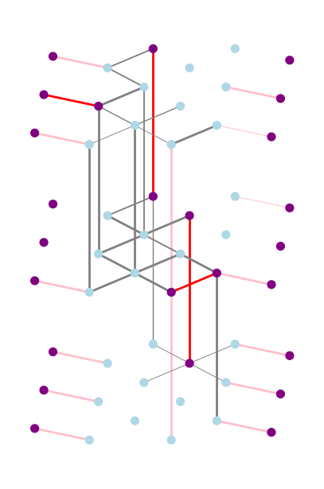
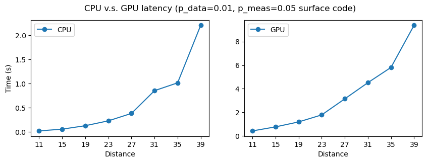

# Netics: GPU-based Distributed QECC Decoder 

This repository contains the implementations of algorithmic decoders for repetition codes and surface codes, especially deployed on GPU in a paradigm of distributed computing.

It is part of my internship work at Alibaba Quantum Laboratory.

**Repetition code:**

| Syndrome graph                               | Monolothic UF decoding                         | Distributed (GPU) UF decoding                  |
| -------------------------------------------- | ---------------------------------------------- | ---------------------------------------------- |
|  |  |  |

**Surface code:**

| Syndrome graph                                | Monolothic UF decoding                          | Distributed (GPU) UF decoding                   |
| --------------------------------------------- | ----------------------------------------------- | ----------------------------------------------- |
|  |  |  |

**CPU v.s. GPU UF decoding on surface code:**

